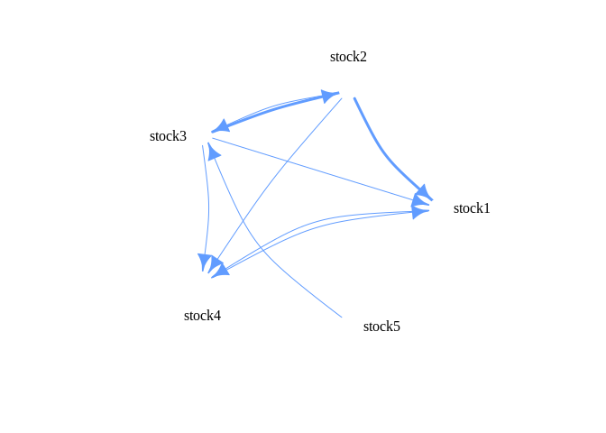

<!-- README.md is generated from README.Rmd. Please edit that file -->

The `tVARlarge` package allows R users to estimate the penalized Vector
AutoRegression model with *t*-distributed innovations (*t*-VAR) proposed
in [Barbaglia et
al. (2020)](https://www.sciencedirect.com/science/article/pii/S0140988319303500?via%3Dihub).
The package allows to compute the resulting volatility spillovers and
visualize them via networks.

## Installation

You can install `tVARlarge` from GitHub as follows:

``` r
install.packages("devtools")
devtools::install_github("lucabarbaglia/t-VAR")
```

## Fit a t-VAR with estimated of the degrees of freedom

Fit a penalized `t-VAR` of order P=2 on the `RV` data set containing the
log-transformed realized volatilities for J=5 stocks and N=500
observations.

``` r
library(tVARlarge)
data(RV)
DATA <- as.matrix(RV)
fit <- Large.tVAR(Data=DATA, P=2, lambda1_OPT = 5, gamma1_OPT = 0.2) 
str(fit, max.level = 1)
#> List of 11
#>  $ Beta_new   : num [1:50, 1] 0.0993 0.024 0.0528 0.0681 0.033 ...
#>   ..- attr(*, "dimnames")=List of 2
#>  $ Beta_arr   : num [1:5, 1:5, 1:2] 0.0993 0.024 0.0528 0.0681 0.033 ...
#>  $ innov      : num [1:498, 1:5] 0.369 0.987 0.943 0.784 1.045 ...
#>  $ Omega_new  : num [1:5, 1:5] 1 0 0 0 0 ...
#>  $ tau_new    : num [1:498, 1] 0.0693 0.4841 1.0158 0.391 0.1396 ...
#>  $ nu_new     : num 1.71
#>  $ Obj_ECM    : num [1:25] 1 -5453 -1446 1 1 ...
#>  $ iter_ECM   : num 4
#>  $ iter_vec   : num [1:25, 1] NA 8 7 NA NA NA NA NA NA NA ...
#>  $ lambda1_opt: num 5
#>  $ gamma1_opt : num 0.2
```

The output of the `Large.tVAR` function is a list containing, among
other ones, the following objects:

  - Beta\_arr: a JxJxP array containing the estimated autoregressive
    coefficients;

  - Omega\_new: a JxJ matrix containing the estimated
    variance-covariance matrix;

  - nu\_new: estimated degrees-of-freedom of the multivaraite
    t-distribution of the VAR innovations.

  - lambda1\_opt: selected value of the regularization parameter on the
    autoregressive coefficients;

  - gamma1\_opt: selected value of the regularization parameter on the
    variance-covariance matrix

If you do not wish to specify the magnitude of the penalization, you
select it via BIC by setting the paramaters `lambda1_min, lambda1_max,
lambda1_steps`. If you do not wish to estimate the degrees-of-freedom of
the multivariate *t* distribution of the VAR innovations, you can use
the `EM_VAR` function.

## Volatilty spillover networks

Build the volatility spillovers from the *t*-VAR estimation.

``` r
# Volatility Spillovers:
vs <- Spillovers(fit = fit)
vs$spill_index      # volatility spillover index
#> [1] 14.97478

# volatility spillover matrix
spills <- vs$spill
colnames(spills) <- rownames(spills) <- colnames(RV)
round(spills,2)
#>        stock1 stock2 stock3 stock4 stock5
#> stock1  94.45   3.10   0.96   1.44   0.04
#> stock2   0.11  96.81   2.75   0.31   0.03
#> stock3   0.31   0.54  97.97   0.36   0.83
#> stock4   0.57   1.39   1.26  96.56   0.22
#> stock5   0.12   0.49   0.11   0.04  99.24
```

Plot the network of volatility spillovers.

``` r
# Volatility spillover network:
network.vs(spill=round(spills))
```

<!-- -->

## References:

  - Barbaglia, L., Croux, C., & Wilms, I. (2020). Volatility spillovers
    in commodity markets: A large t-vector autoregressive approach.
    Energy Economics, 85, 104555.
